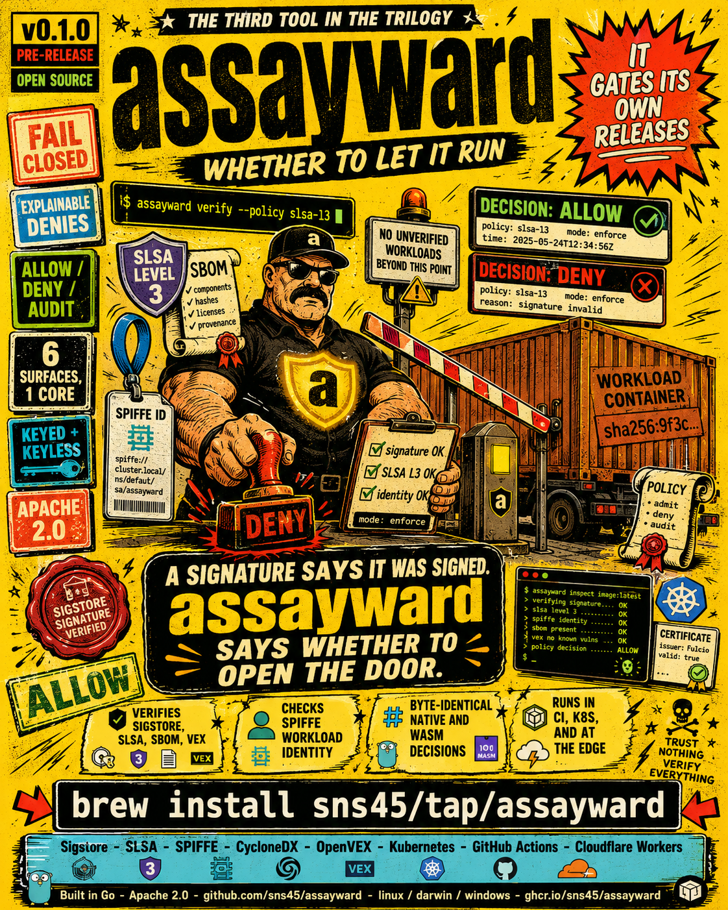

# assayward

> A runtime trust gate that evaluates supply-chain attestations and workload identities to decide **whether to let a workload run**.

<p align="center">
  
</p>

assayward is the third tool in a zero-trust supply-chain trilogy. It ingests the attestations [forgeseal](https://github.com/sns45/forgeseal) produces (CycloneDX SBOM, SLSA provenance, OpenVEX, Sigstore signatures) and the SPIFFE identities [svidmint](https://github.com/sns45/svidmint) issues, evaluates them against a declarative policy, and emits an explainable `allow` / `deny` / `audit` decision at the moment a workload is admitted or invoked.

| Tool | Question it answers |
|------|---------------------|
| forgeseal | *What* is running? |
| svidmint | *Who* is running it? |
| **assayward** | ***Whether* to let it run** |

assayward is a consumer and verifier only. It never generates attestations or mints identities; it verifies the outputs of the other two.

## Design

A single, pure, deterministic Go policy core (`pkg/core`) compiled to multiple surfaces, modeled on OPA: an embeddable engine plus a Wasm artifact plus thin per-surface adapters. No business logic lives in an adapter.

- **`pkg/core` is pure:** no network, no filesystem, no clock reads except through an injected interface. Every input (attestation bundles, identity tokens, trust roots, the current time) is passed in. This is what makes the same code correct in a Wasm sandbox and in a webhook.
- **Deterministic:** identical evidence plus policy plus injected time yields a byte-identical decision across the native and Wasm evaluators (enforced by a wazero parity test).
- **Explainable, fail-closed:** every deny lists the specific failed checks with stable machine-readable codes. The mode is policy-controlled: `enforce` (deny on failure), `audit` (record the decision, always allow), `warn` (annotate, allow).

Verification reuses established libraries (`sigstore-go`, `go-spiffe/v2`, `cyclonedx-go`, `openvex/go-vex`); nothing hand-rolls signature or identity crypto.

## Install

> assayward is pre-release. Build from source for now.

```bash
go build -o assayward ./cmd/assayward
```

Tagged releases will publish cross-platform binaries, a Homebrew formula, a `ghcr.io/sns45/assayward` Docker image, and the `sns45/assayward-action` GitHub Action.

## CLI quickstart

```bash
# Gate an image against a built-in policy. Exit 0 on allow/audit, 1 on deny, 2 on usage error.
assayward verify \
  --image ghcr.io/example/app:1.0.0@sha256:<digest> \
  --bundle app.sbom.sigstore.json --bundle app.slsa.sigstore.json \
  --sigstore-trust-root trusted_root.json \
  --policy slsa-l3

# Human-readable breakdown of the decision (one line per check).
assayward explain --image ... --bundle ... --policy slsa-l3

# Validate a policy document (strict; unknown fields error). Exit 2 if invalid.
assayward policy validate my-policy.yaml

# Assert an expected outcome (CI policy test). Exit 0 if it matches.
assayward policy test --policy slsa-l3 --expect deny --image ... --bundle ...
```

Built-in policies: `baseline` (signature + transparency log), `slsa-l3` (signature + SLSA level 3 + identity), `serverless-edge` (identity-first, signature optional).

Attestation discovery: explicit `--bundle <path>` (offline, deterministic) and cosign-style `--from-oci` OCI referrers discovery. Forgeseal's native output is consumed directly with `--forgeseal-output <dir>`.

## Policy

A `TrustPolicy` is a strict, versioned YAML document. The version appears in every decision.

```yaml
apiVersion: assayward.dev/v1alpha1
kind: TrustPolicy
metadata:
  name: production-default
spec:
  mode: enforce                 # enforce | audit | warn
  signature:
    required: true
    keyless:
      issuer: "https://token.actions.githubusercontent.com"
      identityPattern: "https://github.com/sns45/*"
    rekor:
      required: true
  slsa:
    minLevel: 3
    allowedBuilders: ["https://github.com/sns45/*"]
  vex:
    maxUnmitigatedSeverity: high
  sbom:
    required: true
  identity:
    required: true
    trustDomain: "spiffe://sns45.dev"
    idPattern: "spiffe://sns45.dev/ci/*"
```

Custom org logic via embedded Rego is a documented, scaffolded extension point (native-only); the common case stays typed and Wasm-safe.

## Surfaces

| Surface | Path | What it is |
|---------|------|------------|
| CLI | `cmd/assayward` | the CI primitive (`verify`/`explain`/`policy`) |
| Wasm core | `core/wasm` | stable JSON ABI (`evaluate(evidence, policy, trustRoots) -> decision`), `wasip1` + `js/wasm` |
| npm | `surfaces/npm` | `@sns45/assayward` TypeScript wrapper, `await assay(evidence, policy)` for Workers/Deno/Node |
| Cloudflare Workers | `templates/cloudflare` | `wrangler`-deployable edge gate |
| Kubernetes | `surfaces/k8s-webhook`, `deploy/{helm,kustomize}` | validating admission webhook, **audit-mode first** |
| GitHub Action | `action/` | composite action wrapping `assayward verify` |
| Policy bundles | `internal/bundle` | signed OCI policy-bundle distribution (ORAS) |

### Signature verification: two modes

- **Keyed CA (offline):** verifies a self-signed-CA Sigstore bundle against a provided CA. Pure stdlib crypto, so it runs in **both** the native and Wasm cores.
- **Keyless (Fulcio + Rekor):** verifies a real public-good Sigstore bundle (Fulcio cert chain + Rekor transparency-log inclusion) via sigstore-go, native-only. The Wasm core fails closed on keyless and relies on the keyed path or pre-verified evidence.

## Self-demonstrating loop

The trilogy verifies itself. assayward gates forgeseal's and svidmint's releases against the `slsa-l3` policy, using forgeseal's own attestations and a svidmint publisher SVID, with the release proceeding only on `allow`.

This is validated end to end on real GitHub infrastructure by `.github/workflows/dogfood-e2e.yml` (workflow_dispatch): it runs svidmint in-job, mints a real publisher SVID from the runner's GitHub OIDC token, produces both keyed and keyless forgeseal attestations, and gates them with `assayward verify`. Both legs pass, including real Fulcio + Rekor keyless signature verification.

## Status

v0.1, pre-release. The core, all six surfaces, and the dogfood loop are built and tested; continuous CI runs build, vet, gofmt, the full test suite (including the wazero Wasm-parity and determinism tests), and the surface checks on every push. Distribution (tagged releases, Marketplace listing, npm publish) is pending.

## License

Apache-2.0. See [LICENSE](LICENSE).
